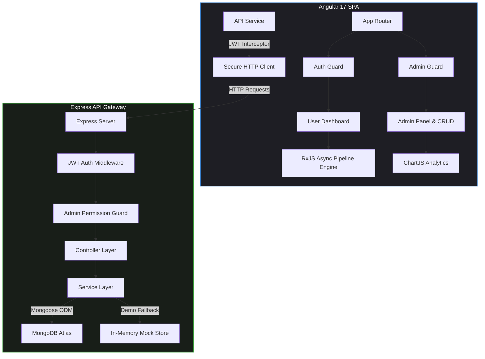

<div align="center">
  
  # 🛡️ MPloyChek — Enterprise Background Verification
  
  ### *AI-Driven Background Auditing & Verification Portal*
  
  [](https://angular.dev/)
  [](https://nodejs.org/)
  [](https://www.typescriptlang.org/)
  [](https://tailwindcss.com/)
  [](https://jwt.io/)

  *A gorgeous, Apple-inspired SaaS portal featuring role-based access controls, asynchronous processing engines, interactive real-time trust scoring, and dynamic responsive metrics dashboards.*
  
  [✨ Live Dashboard Preview](#) • [🚀 Quick Start](#quick-start) • [🛡️ Security Architecture](#security-architecture) • [📊 API System](#api-system)
  
</div>

---

## 🔮 Interactive Capabilities & Features

### 🌟 Ultra-Premium UI/UX
- **Glassmorphism Interface:** Designed with beautiful soft blurs, refined shadows, and custom-curated harmonious color schemes.
- **Micro-Animations:** Fluid, premium state-transitions, hover triggers, and placeholder skeleton structures designed to match modern enterprise SaaS standards.
- **Responsive Layout:** Adaptive sidebar and topbar configuration built on standard grid layouts, ensuring smooth rendering across desktop, tablet, and mobile browsers.

### ⚡ Async Processing Pipelines
- **Live Reactive Engines:** RxJS-powered async pipelines displaying background check stages dynamically (`Queued` ➜ `Processing` ➜ `Cross-Validating` ➜ `Blockchain Hashing` ➜ `Completed`).
- **Dynamic Progress Meters:** Intuitive linear and circular state indicators depicting step durations and live results in real-time.

### 🛡️ Role-Based Access Controls (RBAC)
- **Granular Security:** Distinct permission layers for Administrators and standard Users.
- **Route Guards & Interceptors:** Strict frontend route guards (`AuthGuard`, `AdminGuard`) and JWT bearer token authorization interceptors protecting private APIs.

---

## 🏗️ Enterprise System Architecture



---

## 🚀 Quick Start

### ⚙️ System Requirements
- Node.js `18.x` or higher
- npm `9.x` or higher

### 1️⃣ Clone & Navigate
```bash
git clone <repository-url>
cd MPloyChek
```

### 2️⃣ Initialize Backend API
```bash
cd backend
npm install
npm run dev
```
> 🔌 *The backend will automatically start on `http://localhost:3000`. If MongoDB is not running locally, it gracefully boots into **Demo Mode** with fully loaded in-memory mock datasets.*

### 3️⃣ Initialize Frontend App
```bash
cd ../frontend
npm install
npm start
```
> ⚡ *The Angular server will automatically serve on `http://localhost:4200/`. Simply open your browser to start auditing.*

---

## 🔑 Demo Access Credentials

| Role | Authorized Email | Password | Allowed Capabilities |
| :--- | :--- | :--- | :--- |
| **🛡️ Global Admin** | `admin@mploychek.io` | `admin123` | *Full access to User CRUD, Admin Panel, and Global Analytics* |
| **💼 Staff User** | `user@mploychek.io` | `user123` | *Access to personal verifications, async creation pipeline, and candidate status dashboard* |

---

## 📊 API System

| Method | Endpoint | Authorization | Description |
| :--- | :--- | :--- | :--- |
| **`POST`** | `/api/auth/login` | Public | Authenticates credentials and issues secure JWT token |
| **`GET`** | `/api/auth/me` | Authenticated | Retrieves current user profile session details |
| **`GET`** | `/api/users` | Admin Only | Retrieves paginated users list (supports CRUD search) |
| **`POST`**| `/api/users` | Admin Only | Creates a new user record |
| **`PUT`** | `/api/users/:id` | Admin Only | Modifies active user profiles and permissions |
| **`DELETE`**| `/api/users/:id` | Admin Only | Revokes and deletes a user record |
| **`GET`** | `/api/verifications` | Authenticated | Retrieves verification workflows for the account |
| **`GET`** | `/api/verifications/stats` | Authenticated | Returns aggregate workflow metrics |
| **`GET`** | `/api/analytics/overview` | Admin Only | Delivers system-wide stats and confidence distributions |

---

## 💎 Design & CSS System Tokens

Our styling layout conforms to premium visual tokens that eliminate layout drift and prioritize visually stunning contrasts:
- **Primary Color:** High-saturation Sapphire Blue (`#3178C6`)
- **Accent Tone:** Elegant Gold/Amber Status Tags
- **Backgrounds:** Smooth Frosty Dark Panels (`rgba(17, 24, 39, 0.7)`) with background blur filters (`backdrop-filter: blur(12px)`)
- **Typography:** Modern sans-serif stack utilizing Google Fonts (Inter, Outfit) with premium letter-spacing metrics.

---

## ⚡ Automated Test Verification

A complete end-to-end integration and API verification suite is available. Run it using Node to immediately test response statuses, security guards, and database pipelines:
```bash
node backend/tests/test_api.js
```

---

<div align="center">
  
  *Crafted with 💖 for high-performance background auditing. Built to scale and secure enterprise workforces.*
  
</div>
